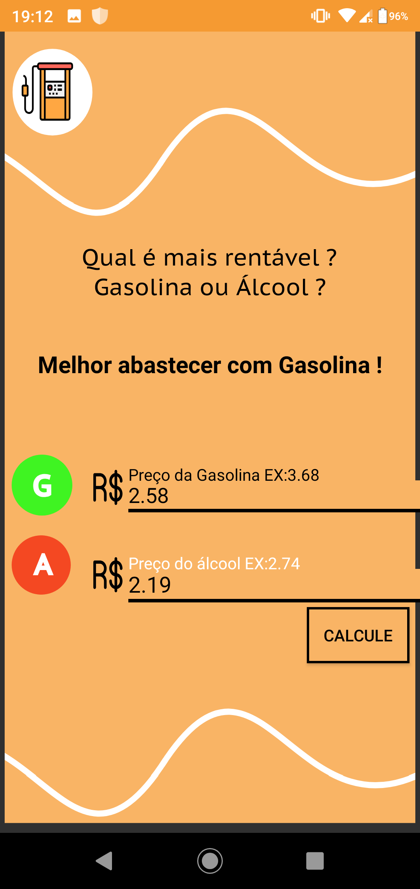

# AlcoolOuGasolina-Projeto


# Sobre
Este é mais um projeto do curso [Desenvolvimento Android Completo - Aprenda a criar 18 apps](https://www.udemy.com/course/curso-de-desenvolvimento-android-oreo/). Este aplicativo, mostra ao usuário se ele deve usar Gasolina ou Álcool, dependendo de um cálculo que é:
```java
resultado = precoAlcool / precoGasolina;
if (resultado > 0.7){
  widget.setText("Abasteçe com Gasolina");
}else{
  widget.setText("Abasteçe com Álcool");
}
```

# Imagens
O App possui duas telas, uma de Loading, e a outra com as caixas de inputText, e as text views, que irão mostrar o resultado para o usuário.

 
 
